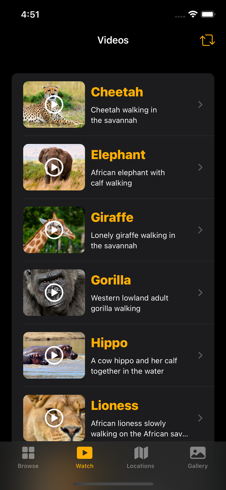

# Animals

---

<h2> 
  Full featured Animals Encyclopedia like app written in SwiftUI.
</h2>

  
  
  
  
  
  

  
  
  

---

<h2>
  Features
</h2>

- Home Page with different grid layouts of animals.
- Detail page about the animal.
- Videos of each animal.
- Location details of the animals.
- Gallery with custom grids.

---

<h2>
  Notes
</h2>

 Use of JSON data stored locally to get animal details.

---

<h2>
  Watch Full Video
</h2>

<a href="https://drive.google.com/file/d/1puOZZn1rn2mGzRHYBJkSOeRG8luW8ET3/view?usp=drivesdk"> Click here to Watch the full Functionality. </a>

---
